# PHASE0 GRC Platform - System Design Diagram

## Overview
This document contains comprehensive system design diagrams for the PHASE0 GRC (Governance, Risk, and Compliance) Platform, showing the complete architecture, component relationships, and data flow.

## High-Level System Architecture

```mermaid
graph TB
    %% External Users
    Admin[👤 Admin]
    RiskMgr[👤 Risk Manager]
    CompOff[👤 Compliance Officer]
    Auditor[👤 Auditor]
    
    %% Frontend Layer
    subgraph "Frontend Layer"
        React[⚛️ React Frontend<br/>Port 3000]
        Nginx[🌐 Nginx Reverse Proxy<br/>Port 80/443]
    end
    
    %% API Gateway
    APIGateway[🚪 API Gateway<br/>Port 8000]
    
    %% Backend Services
    subgraph "Backend Services"
        PolicySvc[📋 Policy Service<br/>Port 8001]
        RiskSvc[⚠️ Risk Service<br/>Port 8002]
        CompSvc[✅ Compliance Service<br/>Port 8003]
        WorkflowSvc[🔄 Workflow Service<br/>Port 8004]
        AIAgents[🤖 AI Agents Service<br/>Port 8005]
    end
    
    %% AI Agents Detail
    subgraph "AI Agents Layer"
        BFSIAgent[🏦 BFSI Agent]
        TelecomAgent[📡 Telecom Agent]
        MfgAgent[🏭 Manufacturing Agent]
        HealthAgent[🏥 Healthcare Agent]
        CompAgent[📋 Compliance Agent]
        RiskAgent[⚠️ Risk Agent]
        DocAgent[📄 Document Agent]
        CommAgent[💬 Communication Agent]
        Orchestrator[🎯 Orchestrator]
    end
    
    %% Data Layer
    subgraph "Data Layer"
        PostgreSQL[(🐘 PostgreSQL<br/>Port 5432)]
        Redis[(🔴 Redis Cache<br/>Port 6379)]
        VectorDB[(🔍 Vector Database)]
        Ollama[🧠 Ollama LLM<br/>Port 11434]
    end
    
    %% External Systems
    subgraph "External Systems"
        OpenAI[🤖 OpenAI API]
        HuggingFace[🤗 Hugging Face]
        ExternalAPIs[🌐 External APIs]
    end
    
    %% User Connections
    Admin --> Nginx
    RiskMgr --> Nginx
    CompOff --> Nginx
    Auditor --> Nginx
    
    %% Frontend Flow
    Nginx --> React
    React --> APIGateway
    
    %% API Gateway Routing
    APIGateway --> PolicySvc
    APIGateway --> RiskSvc
    APIGateway --> CompSvc
    APIGateway --> WorkflowSvc
    APIGateway --> AIAgents
    
    %% AI Agents Internal Structure
    AIAgents --> Orchestrator
    Orchestrator --> BFSIAgent
    Orchestrator --> TelecomAgent
    Orchestrator --> MfgAgent
    Orchestrator --> HealthAgent
    Orchestrator --> CompAgent
    Orchestrator --> RiskAgent
    Orchestrator --> DocAgent
    Orchestrator --> CommAgent
    
    %% Data Connections
    PolicySvc --> PostgreSQL
    RiskSvc --> PostgreSQL
    CompSvc --> PostgreSQL
    WorkflowSvc --> PostgreSQL
    AIAgents --> PostgreSQL
    
    PolicySvc --> Redis
    RiskSvc --> Redis
    CompSvc --> Redis
    WorkflowSvc --> Redis
    AIAgents --> Redis
    
    AIAgents --> VectorDB
    AIAgents --> Ollama
    
    %% External Connections
    AIAgents --> OpenAI
    AIAgents --> HuggingFace
    AIAgents --> ExternalAPIs
    
    %% Styling
    classDef userClass fill:#e1f5fe,stroke:#01579b,stroke-width:2px
    classDef frontendClass fill:#f3e5f5,stroke:#4a148c,stroke-width:2px
    classDef serviceClass fill:#e8f5e8,stroke:#1b5e20,stroke-width:2px
    classDef aiClass fill:#fff3e0,stroke:#e65100,stroke-width:2px
    classDef dataClass fill:#fce4ec,stroke:#880e4f,stroke-width:2px
    classDef externalClass fill:#f1f8e9,stroke:#33691e,stroke-width:2px
    
    class Admin,RiskMgr,CompOff,Auditor userClass
    class React,Nginx frontendClass
    class APIGateway,PolicySvc,RiskSvc,CompSvc,WorkflowSvc,AIAgents serviceClass
    class BFSIAgent,TelecomAgent,MfgAgent,HealthAgent,CompAgent,RiskAgent,DocAgent,CommAgent,Orchestrator aiClass
    class PostgreSQL,Redis,VectorDB,Ollama dataClass
    class OpenAI,HuggingFace,ExternalAPIs externalClass
```

## Detailed AI Agents Architecture

```mermaid
graph TB
    %% Main Orchestrator
    MainOrch[🎯 Main Orchestrator<br/>GRCPlatformOrchestrator]
    
    %% Industry Agents
    subgraph "Industry-Specific Agents"
        BFSI[🏦 BFSI Agent<br/>Banking & Financial Services]
        Telecom[📡 Telecom Agent<br/>Telecommunications]
        Mfg[🏭 Manufacturing Agent<br/>Industrial Manufacturing]
        Health[🏥 Healthcare Agent<br/>Healthcare & Life Sciences]
    end
    
    %% Specialized Agents
    subgraph "Specialized Agents"
        Comp[📋 Compliance Agent<br/>General Compliance]
        Risk[⚠️ Risk Agent<br/>Risk Assessment]
        Doc[📄 Document Agent<br/>Document Processing]
        Comm[💬 Communication Agent<br/>Inter-agent Communication]
    end
    
    %% Shared Components
    subgraph "Shared Components"
        BaseAgent[🔧 Base Agent<br/>Core Functionality]
        IndustryAgent[🏭 Industry Agent<br/>Industry Base Class]
        MCPBroker[📡 MCP Broker<br/>Protocol Communication]
        Settings[⚙️ Settings<br/>Configuration Management]
    end
    
    %% Integration Layer
    subgraph "Integration Layer"
        OllamaInt[🧠 Ollama Integration<br/>Local LLM]
        ChromaInt[🔍 Chroma Integration<br/>Vector Database]
        OpenAIInt[🤖 OpenAI Integration<br/>External LLM]
        HuggingFaceInt[🤗 Hugging Face Integration<br/>Model Hub]
    end
    
    %% Performance & Monitoring
    subgraph "Performance & Monitoring"
        PerfMon[📊 Performance Monitoring<br/>Real-time Metrics]
        Migration[🔄 Migration Strategy<br/>Legacy Support]
        BackCompat[🔙 Backward Compatibility<br/>API Compatibility]
    end
    
    %% Orchestrator Connections
    MainOrch --> BFSI
    MainOrch --> Telecom
    MainOrch --> Mfg
    MainOrch --> Health
    MainOrch --> Comp
    MainOrch --> Risk
    MainOrch --> Doc
    MainOrch --> Comm
    
    %% Agent Inheritance
    BFSI --> IndustryAgent
    Telecom --> IndustryAgent
    Mfg --> IndustryAgent
    Health --> IndustryAgent
    Comp --> BaseAgent
    Risk --> BaseAgent
    Doc --> BaseAgent
    Comm --> BaseAgent
    
    IndustryAgent --> BaseAgent
    
    %% Communication
    MainOrch --> MCPBroker
    BFSI --> MCPBroker
    Telecom --> MCPBroker
    Mfg --> MCPBroker
    Health --> MCPBroker
    Comp --> MCPBroker
    Risk --> MCPBroker
    Doc --> MCPBroker
    Comm --> MCPBroker
    
    %% Configuration
    MainOrch --> Settings
    BFSI --> Settings
    Telecom --> Settings
    Mfg --> Settings
    Health --> Settings
    Comp --> Settings
    Risk --> Settings
    Doc --> Settings
    Comm --> Settings
    
    %% Integration Connections
    MainOrch --> OllamaInt
    MainOrch --> ChromaInt
    MainOrch --> OpenAIInt
    MainOrch --> HuggingFaceInt
    
    %% Monitoring Connections
    MainOrch --> PerfMon
    MainOrch --> Migration
    MainOrch --> BackCompat
    
    %% Styling
    classDef orchestratorClass fill:#ffeb3b,stroke:#f57f17,stroke-width:3px
    classDef industryClass fill:#4caf50,stroke:#1b5e20,stroke-width:2px
    classDef specializedClass fill:#2196f3,stroke:#0d47a1,stroke-width:2px
    classDef sharedClass fill:#ff9800,stroke:#e65100,stroke-width:2px
    classDef integrationClass fill:#9c27b0,stroke:#4a148c,stroke-width:2px
    classDef monitoringClass fill:#f44336,stroke:#b71c1c,stroke-width:2px
    
    class MainOrch orchestratorClass
    class BFSI,Telecom,Mfg,Health industryClass
    class Comp,Risk,Doc,Comm specializedClass
    class BaseAgent,IndustryAgent,MCPBroker,Settings sharedClass
    class OllamaInt,ChromaInt,OpenAIInt,HuggingFaceInt integrationClass
    class PerfMon,Migration,BackCompat monitoringClass
```

## Data Flow Architecture

```mermaid
sequenceDiagram
    participant User as 👤 User
    participant Frontend as ⚛️ React Frontend
    participant Gateway as 🚪 API Gateway
    participant Service as 🔧 Backend Service
    participant AI as 🤖 AI Agents
    participant DB as 🐘 PostgreSQL
    participant Cache as 🔴 Redis
    participant Vector as 🔍 Vector DB
    participant LLM as 🧠 Ollama/OpenAI
    
    %% User Request Flow
    User->>Frontend: 1. User Action
    Frontend->>Gateway: 2. API Request
    Gateway->>Service: 3. Route to Service
    
    %% Service Processing
    Service->>Cache: 4. Check Cache
    alt Cache Hit
        Cache-->>Service: 5a. Return Cached Data
    else Cache Miss
        Service->>DB: 5b. Query Database
        DB-->>Service: 6b. Return Data
        Service->>Cache: 7b. Update Cache
    end
    
    %% AI Processing
    Service->>AI: 8. AI Processing Request
    AI->>Vector: 9. Vector Search
    Vector-->>AI: 10. Similarity Results
    AI->>LLM: 11. LLM Processing
    LLM-->>AI: 12. AI Response
    AI->>DB: 13. Store AI Results
    AI-->>Service: 14. AI Response
    
    %% Response Flow
    Service-->>Gateway: 15. Service Response
    Gateway-->>Frontend: 16. API Response
    Frontend-->>User: 17. UI Update
    
    %% Real-time Updates
    Service->>Frontend: 18. WebSocket Update
    Frontend-->>User: 19. Real-time Notification
```

## Deployment Architecture

```mermaid
graph TB
    %% Load Balancer
    LB[⚖️ Load Balancer<br/>Nginx]
    
    %% Frontend Tier
    subgraph "Frontend Tier"
        Frontend1[⚛️ React App 1]
        Frontend2[⚛️ React App 2]
        Frontend3[⚛️ React App 3]
    end
    
    %% API Gateway Tier
    subgraph "API Gateway Tier"
        Gateway1[🚪 API Gateway 1]
        Gateway2[🚪 API Gateway 2]
    end
    
    %% Service Tier
    subgraph "Service Tier"
        Policy1[📋 Policy Service 1]
        Policy2[📋 Policy Service 2]
        Risk1[⚠️ Risk Service 1]
        Risk2[⚠️ Risk Service 2]
        Comp1[✅ Compliance Service 1]
        Comp2[✅ Compliance Service 2]
        Workflow1[🔄 Workflow Service 1]
        Workflow2[🔄 Workflow Service 2]
        AI1[🤖 AI Agents 1]
        AI2[🤖 AI Agents 2]
    end
    
    %% Data Tier
    subgraph "Data Tier"
        PostgresMaster[(🐘 PostgreSQL Master)]
        PostgresSlave1[(🐘 PostgreSQL Slave 1)]
        PostgresSlave2[(🐘 PostgreSQL Slave 2)]
        RedisCluster[🔴 Redis Cluster]
        VectorCluster[🔍 Vector DB Cluster]
    end
    
    %% External Services
    subgraph "External Services"
        OllamaCluster[🧠 Ollama Cluster]
        OpenAIAPI[🤖 OpenAI API]
        HuggingFaceAPI[🤗 Hugging Face API]
    end
    
    %% Load Balancer Connections
    LB --> Frontend1
    LB --> Frontend2
    LB --> Frontend3
    
    %% Frontend to Gateway
    Frontend1 --> Gateway1
    Frontend1 --> Gateway2
    Frontend2 --> Gateway1
    Frontend2 --> Gateway2
    Frontend3 --> Gateway1
    Frontend3 --> Gateway2
    
    %% Gateway to Services
    Gateway1 --> Policy1
    Gateway1 --> Policy2
    Gateway1 --> Risk1
    Gateway1 --> Risk2
    Gateway1 --> Comp1
    Gateway1 --> Comp2
    Gateway1 --> Workflow1
    Gateway1 --> Workflow2
    Gateway1 --> AI1
    Gateway1 --> AI2
    
    Gateway2 --> Policy1
    Gateway2 --> Policy2
    Gateway2 --> Risk1
    Gateway2 --> Risk2
    Gateway2 --> Comp1
    Gateway2 --> Comp2
    Gateway2 --> Workflow1
    Gateway2 --> Workflow2
    Gateway2 --> AI1
    Gateway2 --> AI2
    
    %% Service to Data
    Policy1 --> PostgresMaster
    Policy2 --> PostgresMaster
    Risk1 --> PostgresMaster
    Risk2 --> PostgresMaster
    Comp1 --> PostgresMaster
    Comp2 --> PostgresMaster
    Workflow1 --> PostgresMaster
    Workflow2 --> PostgresMaster
    AI1 --> PostgresMaster
    AI2 --> PostgresMaster
    
    Policy1 --> PostgresSlave1
    Policy2 --> PostgresSlave2
    Risk1 --> PostgresSlave1
    Risk2 --> PostgresSlave2
    
    Policy1 --> RedisCluster
    Policy2 --> RedisCluster
    Risk1 --> RedisCluster
    Risk2 --> RedisCluster
    Comp1 --> RedisCluster
    Comp2 --> RedisCluster
    Workflow1 --> RedisCluster
    Workflow2 --> RedisCluster
    AI1 --> RedisCluster
    AI2 --> RedisCluster
    
    AI1 --> VectorCluster
    AI2 --> VectorCluster
    
    %% External Connections
    AI1 --> OllamaCluster
    AI2 --> OllamaCluster
    AI1 --> OpenAIAPI
    AI2 --> OpenAIAPI
    AI1 --> HuggingFaceAPI
    AI2 --> HuggingFaceAPI
    
    %% Database Replication
    PostgresMaster --> PostgresSlave1
    PostgresMaster --> PostgresSlave2
    
    %% Styling
    classDef loadBalancerClass fill:#ff9800,stroke:#e65100,stroke-width:3px
    classDef frontendClass fill:#4caf50,stroke:#1b5e20,stroke-width:2px
    classDef gatewayClass fill:#2196f3,stroke:#0d47a1,stroke-width:2px
    classDef serviceClass fill:#9c27b0,stroke:#4a148c,stroke-width:2px
    classDef dataClass fill:#f44336,stroke:#b71c1c,stroke-width:2px
    classDef externalClass fill:#607d8b,stroke:#263238,stroke-width:2px
    
    class LB loadBalancerClass
    class Frontend1,Frontend2,Frontend3 frontendClass
    class Gateway1,Gateway2 gatewayClass
    class Policy1,Policy2,Risk1,Risk2,Comp1,Comp2,Workflow1,Workflow2,AI1,AI2 serviceClass
    class PostgresMaster,PostgresSlave1,PostgresSlave2,RedisCluster,VectorCluster dataClass
    class OllamaCluster,OpenAIAPI,HuggingFaceAPI externalClass
```

## Technology Stack Overview

```mermaid
graph LR
    %% Frontend Stack
    subgraph "Frontend Stack"
        React[⚛️ React 18]
        Redux[🔄 Redux Toolkit]
        MUI[🎨 Material-UI]
        ChartJS[📊 Chart.js]
        Vite[⚡ Vite]
    end
    
    %% Backend Stack
    subgraph "Backend Stack"
        FastAPI[🚀 FastAPI]
        SQLAlchemy[🗄️ SQLAlchemy]
        Pydantic[✅ Pydantic]
        Celery[⚙️ Celery]
        Uvicorn[🦄 Uvicorn]
    end
    
    %% AI/ML Stack
    subgraph "AI/ML Stack"
        OpenAI[🤖 OpenAI GPT-4]
        Ollama[🧠 Ollama]
        Chroma[🔍 Chroma]
        LangChain[🔗 LangChain]
        HuggingFace[🤗 Hugging Face]
    end
    
    %% Database Stack
    subgraph "Database Stack"
        PostgreSQL[🐘 PostgreSQL 15]
        Redis[🔴 Redis 7]
        Elasticsearch[🔍 Elasticsearch]
        MongoDB[🍃 MongoDB]
    end
    
    %% Infrastructure Stack
    subgraph "Infrastructure Stack"
        Docker[🐳 Docker]
        Kubernetes[☸️ Kubernetes]
        Nginx[🌐 Nginx]
        Prometheus[📊 Prometheus]
        Grafana[📈 Grafana]
    end
    
    %% Connections
    React --> FastAPI
    Redux --> FastAPI
    FastAPI --> SQLAlchemy
    FastAPI --> PostgreSQL
    FastAPI --> Redis
    FastAPI --> OpenAI
    FastAPI --> Ollama
    FastAPI --> Chroma
    
    Docker --> Kubernetes
    Nginx --> Docker
    Prometheus --> Grafana
    
    %% Styling
    classDef frontendStack fill:#61dafb,stroke:#20232a,stroke-width:2px
    classDef backendStack fill:#009688,stroke:#004d40,stroke-width:2px
    classDef aiStack fill:#ff6b35,stroke:#d84315,stroke-width:2px
    classDef dbStack fill:#336791,stroke:#1a237e,stroke-width:2px
    classDef infraStack fill:#2496ed,stroke:#0d47a1,stroke-width:2px
    
    class React,Redux,MUI,ChartJS,Vite frontendStack
    class FastAPI,SQLAlchemy,Pydantic,Celery,Uvicorn backendStack
    class OpenAI,Ollama,Chroma,LangChain,HuggingFace aiStack
    class PostgreSQL,Redis,Elasticsearch,MongoDB dbStack
    class Docker,Kubernetes,Nginx,Prometheus,Grafana infraStack
```

## Key Features & Capabilities

### 🏭 Industry-Specific GRC
- **BFSI**: Banking, Financial Services & Insurance compliance
- **Telecom**: Telecommunications & Communications regulations
- **Manufacturing**: Industrial Manufacturing standards
- **Healthcare**: Healthcare & Life Sciences compliance

### 🤖 AI-Powered Automation
- **Compliance Monitoring**: Automated compliance checking
- **Risk Assessment**: AI-driven risk evaluation
- **Document Analysis**: Intelligent document processing
- **Predictive Analytics**: Risk forecasting and trends

### 🔄 Multi-Agent Orchestration
- **Cross-Industry Operations**: Multi-industry compliance checks
- **Agent Coordination**: Intelligent agent communication
- **Performance Monitoring**: Real-time agent performance tracking
- **Scalable Architecture**: Horizontal scaling capabilities

### 📊 Advanced Analytics
- **Real-time Dashboards**: Live compliance and risk metrics
- **Custom Reporting**: Configurable report generation
- **Data Visualization**: Interactive charts and graphs
- **Audit Trails**: Comprehensive activity logging

### 🛡️ Security & Compliance
- **Role-based Access**: Granular permission system
- **Data Encryption**: End-to-end encryption
- **Audit Logging**: Complete activity tracking
- **Regulatory Compliance**: Industry-specific frameworks

## Performance Metrics

### Response Times
- **API Gateway**: < 100ms
- **Standard Operations**: < 2 seconds
- **AI Processing**: < 5 seconds
- **Cross-Agent Operations**: < 10 seconds

### Scalability
- **Concurrent Users**: 10,000+
- **API Requests**: 100,000+ per hour
- **AI Operations**: 1,000+ per minute
- **Database Queries**: 1M+ per hour

### Availability
- **System Uptime**: 99.9%
- **Service Availability**: 99.95%
- **Data Backup**: Daily automated backups
- **Disaster Recovery**: < 4 hours RTO

This comprehensive system design provides a complete overview of the PHASE0 GRC Platform architecture, showing how all components work together to deliver enterprise-grade governance, risk, and compliance management across multiple industries.
